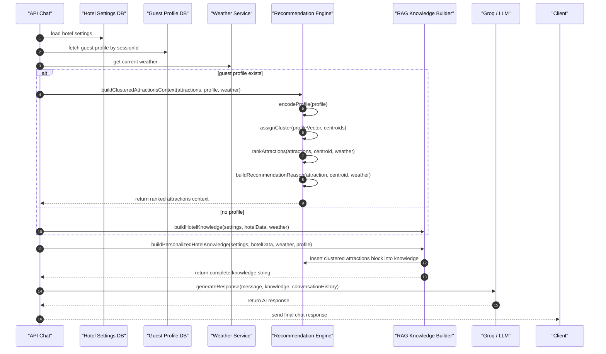

# Recommendation Engine Sequence Diagram

```mermaid
sequenceDiagram
  autonumber
  participant ChatAPI as "API Chat"
  participant HotelDB as "Hotel Settings DB"
  participant ProfileDB as "Guest Profile DB"
  participant Weather as "Weather Service"
  participant RecEngine as "Recommendation Engine"
  participant RAG as "RAG Knowledge Builder"
  participant LLM as "Groq / LLM"
  participant Client as "Client"

  ChatAPI->>HotelDB: load hotel settings
  ChatAPI->>ProfileDB: fetch guest profile by sessionId
  ChatAPI->>Weather: get current weather

  alt guest profile exists
    ChatAPI->>RecEngine: buildClusteredAttractionsContext(attractions, profile, weather)
    RecEngine->>RecEngine: encodeProfile(profile)
    RecEngine->>RecEngine: assignCluster(profileVector, centroids)
    RecEngine->>RecEngine: rankAttractions(attractions, centroid, weather)
    RecEngine->>RecEngine: buildRecommendationReason(attraction, centroid, weather)
    RecEngine-->>ChatAPI: return ranked attractions context
  else no profile
    ChatAPI->>RAG: buildHotelKnowledge(settings, hotelData, weather)
  end

  ChatAPI->>RAG: buildPersonalizedHotelKnowledge(settings, hotelData, weather, profile)
  RAG->>RecEngine: insert clustered attractions block into knowledge
  RAG-->>ChatAPI: return complete knowledge string

  ChatAPI->>LLM: generateResponse(message, knowledge, conversationHistory)
  LLM-->>ChatAPI: return AI response
  ChatAPI-->>Client: send final chat response
```
